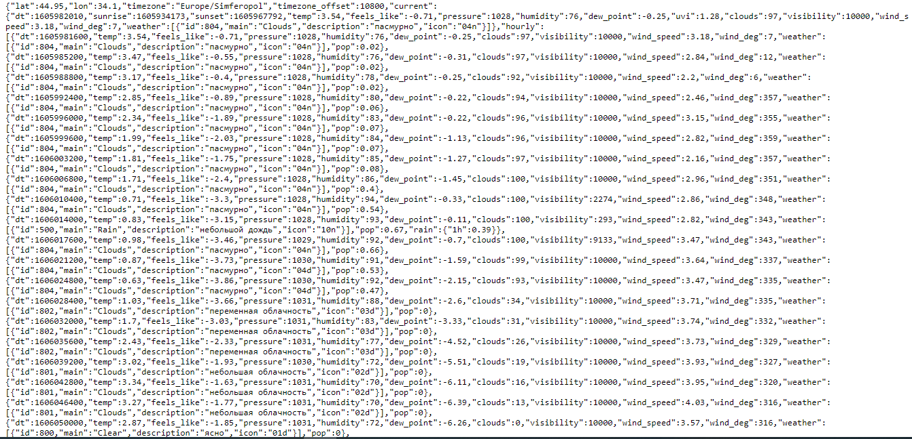
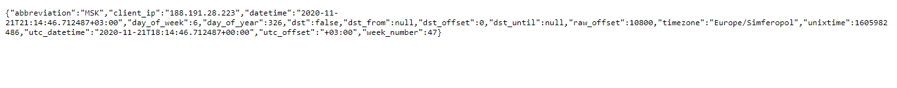
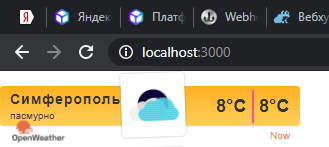
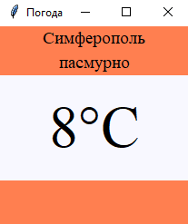

<p align="center">МИНИСТЕРСТВО НАУКИ  И ВЫСШЕГО ОБРАЗОВАНИЯ РОССИЙСКОЙ ФЕДЕРАЦИИ<br>
Федеральное государственное автономное образовательное учреждение высшего образования<br>
"КРЫМСКИЙ ФЕДЕРАЛЬНЫЙ УНИВЕРСИТЕТ им. В. И. ВЕРНАДСКОГО"<br>
ФИЗИКО-ТЕХНИЧЕСКИЙ ИНСТИТУТ<br>
Кафедра компьютерной инженерии и моделирования</p>
<br>
<h3 align="center">Отчёт по лабораторной работе № 1<br> по дисциплине "Программирование"</h3>
<br><br>
<p>студента 1 курса группы ИВТ-б-о-202(1)<br>
Щипко Даниил Игоревич<br>
направления подготовки 09.03.01 "Информатика и вычислительная техника"</p>
<br><br>
<table>
<tr><td>Научный руководитель<br> старший преподаватель кафедры<br> компьютерной инженерии и моделирования</td>
<td>(оценка)</td>
<td>Чабанов В.В.</td>
</tr>
</table>
<br><br>
<p align="center">Симферополь, 2020</p>
<hr>

### Цель:

1. Закрепить навыки разработки многофайловыx приложений;
2. Изучить способы работы с API web-сервиса;
3. Изучить процесс сериализации/десериализации данных в/из json;
4. Получить базовое представление о сетевом взаимодействии приложений;

## Постановка задачи
Разработать сервис предоставляющий данные о погоде в городе Симферополе на момент запроса. В качестве источника данных о погоде используйте: [http://openweathermap.org/](http://openweathermap.org/). В состав сервиса входит: серверное приложение на языке С++ и клиентское приложение на языке Python.

Серверное приложение (далее Сервер) предназначенное для обслуживания клиентских приложений и минимизации количества запросов к сервису _openweathermap.org_. Сервер должен обеспечивать возможность получения данных в формате JSON и виде _html_ виджета (для вставки виджета на страницу будет использоваться _[iframe](https://habr.com/ru/post/488516/)_).

Клиентское приложение должно иметь графический интерфейс отображающий сведения о погоде и возможность обновления данных по требованию пользователя.

## Выполнение работы
  Для начала работы нам потребуется получить все необходимые запросы,через которые мы и будем обращаться на сервера openweathermap.org и worldtimeapi.org. Для этого выполнил следующее:
  
1. Зарегистрировался на сайте http://openweathermap.org/ в разделе My API Keys получил свой API ключ для получения данных с сайта:

>0083423f4d6d9885477d9ae0b151ab8f
2. Составил запрос для получения  прогноза погоды:

>http://api.openweathermap.org//data/2.5/onecall?lat=44.952116&lon=34.102411&lang=ru&units=metric&appid=0083423f4d6d9885477d9ae0b151ab8f

При вводе данного запроса получаем json ответ с нужной нам информацией о погоде в Симферополе(Рис. 1) 

<p align="center">  </p>
<p align="center"> Рис. 1 - JSON ответ на обращение к openweathermap.org </p> </br>

3. Составил запрос для получения  времени в Симферополе:

>http://worldtimeapi.org/api/timezone/Europe/Simferopol

При вводе данного запроса получаем json ответ с нужной нам информацией о времени в Симферополе(Рис. 2)

<p align="center">  </p>
<p align="center"> Рис. 2 - JSON ответ на обращение к worldtimeapi.org </p> </br>

4. Написал сервер на языке С++, который при запуске получает данные о погоде и сохраняет их в кэш, далее слушает запросы на localhost:3000 и localhost:3000/raw.
При запросе "/" сервер берет шаблон html виджета из папки с сервером, делает запрос на *worldtimeapi.org* получает ответ с текущим временем, сравнивает время с 0 и кешированным временем + час, если кешированное время больше, то на формирование ответа уходит кеш время,если нет или кеша вообще нет, текущее время записывается в кеш и поднимается для формирования ответа. На данный запрос получаем ответ в виде виджета (Рис. 3).
При запросе "/raw" сервер берет те же данные что и для виджета.
Для работы с Web запросами использовалась библиотека *https://github.com/yhirose/cpp-httplib* , для работы с JSON библиотека *https://github.com/nlohmann/json* .
Код C++ сервера:
```C++
#include <iostream>
#include <string>
#include <iomanip>
#include <fstream>
#include <cpp_httplib/httplib.h>
#include <nlohmann/json.hpp>

using json = nlohmann::json;
using namespace httplib;
json _json;
int unixtime = 0;
int cache_time_new = 0;
int temp = 0;
int w = 0;
json _json_cache_weth;
json _json_time;

void gen_response(const Request& req, Response& rez) {
    std::string str;
    std::ifstream l("Wid.html");                                                    //шаблон виджета 
    Client Cli("http://worldtimeapi.org");                      //
    auto answer = Cli.Get("/api/timezone/Europe/Simferopol");            //
    if (answer) {                                  //
      if (answer->status == 200) {                        //"фильтр" ошибок
        _json_time = json::parse(answer->body);                  //получаем json времени
        unixtime = _json_time["unixtime"].get<int>();              
      }                                        
      else {                                      
        std::cout << "Status code: " << answer->status << std::endl;        
      }
    }
    else {
      auto Error = answer.error();
      std::cout << "Error code: " << Error << std::endl;
    }
    Client cli("http://api.openweathermap.org");
    auto _answer = cli.Get("/data/2.5/onecall?lat=44.952116&lon=34.102411&lang=ru&units=metric&appid=0083423f4d6d9885477d9ae0b151ab8f");
    if (_answer) {
    
      if (_answer->status == 200) {
        _json_cache_weth = json::parse(_answer->body);              //получаем json погоды
        cache_time_new = _json_cache_weth["hourly"][_json_cache_weth["hourly"].size() - 1]["dt"].get<int>(); // достаем время из полученного  json погоды
      
        for (int i = _json_cache_weth["hourly"].size(); i > 0; --i) {
          for (int q = 0; q < _json_cache_weth["hourly"].size(); q++) {
            if (cache_time_new > unixtime and _json_cache_weth["hourly"][q]["dt"] <= cache_time_new) {   //сравниваем время 
              temp = _json_cache_weth["hourly"][q]["dt"];                        //если устарело или его вовсе нет в кеше кидаем в кеш
              cache_time_new = temp;
              w = q;
            }
          }

        }

      }
      else {
        std::cout << "Status code: " << _answer->status << std::endl;
      }
    }
    else {
      auto Error = _answer.error();
      std::cout << "Error code: " << Error << std::endl;
    }

    _json["description"] = _json_cache_weth["hourly"][w]["weather"][0]["description"];
    _json["temp"] = std::to_string(_json_cache_weth["hourly"][w]["temp"].get<int>());
    std::getline(l, str, '\0');
    while (str.find("{hourly[i].temp}") != std::string::npos)
      str.replace(str.find("{hourly[i].temp}"), 16, std::to_string(_json_cache_weth["hourly"][w]["temp"].get<int>()));            //замена значений 
    str.replace(str.find("{hourly[i].weather[0].description}"), 34, _json_cache_weth["hourly"][w]["weather"][0]["description"]);        //в виджете
    str.replace(str.find("{hourly[i].weather[0].icon}"), 27, _json_cache_weth["hourly"][w]["weather"][0]["icon"]);
    rez.set_content(str, "text/html");
    }

void gen_response_raw(const Request& req, Response& rez) {
  Client("http://localhost:3000").Get("/");
  rez.set_content(_json.dump(), "text/json");
}

int main() {
  Server svr;
  svr.Get("/raw", gen_response_raw);
  svr.Get("/", gen_response);
  std::cout << "Start server... OK\n";
  svr.listen("localhost", 3000);
}

```
<p align="center">  </p>
<p align="center"> Рис. 3 - HTML виджет </p> </br>


5. Сделал клиенское приложение с графическим интерфейсом на языке Python при помощи библиотеки tkinter (Рис. 4).При запуске приложения получаем окно с названием "погода" и надписью Симферополь. После клика по этому окну приложение отправляет запрос "localhost:3000/raw" на сервер, в ответ получает данные о температуре и погоде в формате UTF8 и записывает их в переменную.
Выводит  текст с текущей погодой и температурой. При повторном клике мышкой в любой точке интерфейса, приложение обновляет информацию о погоде, отправляя запрос на сервер.
Для работы с JSON в Python использовался модуль json, для создания графического интерфейса использовалась библиотека tkinter, для создания request запросов использовался модуль requests. Код клиенского Python приложения:
```Python
from tkinter import *
from tkinter.font import BOLD
import requests
import json

def reload_data(event=None):
  try:
    response = requests.get('http://localhost:3000/raw').content.decode("utf8")
    cache = json.loads(response)

    desc.config(text=str(cache["description"]))
    temp.config(text=str(cache["temp"]) + "°C")
  except requests.exceptions.ConnectionError:
    pass

root = Tk()
root.title("Погода")
root.pack_propagate()
root.bind("<Button-1>", reload_data)


top_frame =    Frame(root, bg="coral")
middle_frame = Frame(root, bg="ghost white")
bottom_frame = Frame(root, bg="coral", width=200, height=50)

top_frame.pack(side=TOP, fill=X)
middle_frame.pack(expand=True, fill=BOTH)
bottom_frame.pack(side=BOTTOM, fill=X)

city = Label(top_frame, font=("Times New Roman", 14), text="Симферополь", bg="coral")
desc = Label(top_frame, font=("Times New Roman", 14), bg="coral")
temp = Label(middle_frame, font=("Times New Roman", 48), bg="ghost white")

city.pack(pady=0)
desc.pack(pady=0)
temp.pack(expand=True)


root.mainloop()
```
<p align="center">  </p>
<p align="center"> Рисунок 4 - Интерфейс клиенского приложения </p> </br>

6. Также для безопасной работы скачал и протестировал программу для "проброса" мостов - ngrok.

**Вывод:** Создал серверное и клиенсткое приложение,благодаря которым можно полуить актуальную погоду в городе Симферополь. Получил опыт работы с API. Разобрался в сетевом взаимодействии приложений, принципе работы Req запросов.
Получил дополнительный опыт работы с json, научился менять исходный json файл в зависимости от обстоятельств. Попрактиковал к написание приложения с интерфейсом на языке Python.