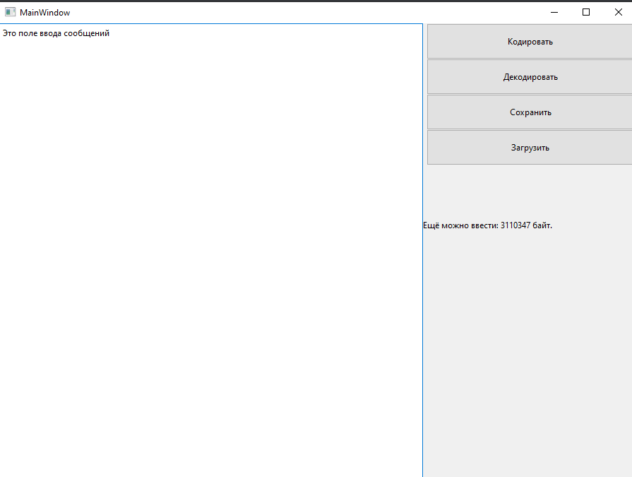
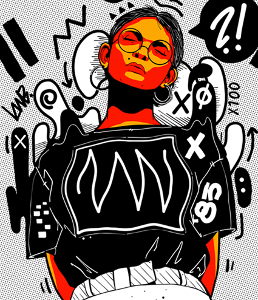

МИНИСТЕРСТВО НАУКИ  И ВЫСШЕГО ОБРАЗОВАНИЯ РОССИЙСКОЙ ФЕДЕРАЦИИ 
Федеральное государственное автономное образовательное учреждение высшего образования 
"КРЫМСКИЙ ФЕДЕРАЛЬНЫЙ УНИВЕРСИТЕТ им. В. И. ВЕРНАДСКОГО" 
ФИЗИКО-ТЕХНИЧЕСКИЙ ИНСТИТУТ 
Кафедра компьютерной инженерии и моделирования

 
<h3 align="center">Отчёт по лабораторной работе № 5  по дисциплине "Программирование"</h3>
  

студента 1 курса группы ПИ-б-о-201(1) 
Щипко Даниила Игоревича 
направления подготовки 09.03.04 "Программная инженерия"

  
<table>
<tr><td>Научный руководитель  старший преподаватель кафедры  компьютерной инженерии и моделирования</td>
<td>(оценка)</td>
<td>Чабанов В.В.</td>
</tr>
</table>
  

Симферополь, 2021

## Цель:

1. Изучить базовые встроенные элементы фреймворка Qt предназначенные для создания приложений с графическим интерфейсом пользователя (GUI);
2. Изучить сигнально-слотовую систему, как один из способов организации взаимодействия компонентов GUI;
3. Получить практический навык работы с побитовыми операторами.
## Постановка задачи
Создать десктоп приложение с GUI позволяющее сохранять текстовую информацию в изображение формата png без видимого изменения исходного изображения. Приложение должно позволять сохранять текст в картинку и извлекать текст из картинки.

## Выполнение работы
Для начала работы переходим в приложение Qt Designer создаем в нем форму нужную для нашего приложения. Далее, после того как форма готова, переходим во вкладку "форма" и выбираем "показать код...", копируем код и вставляем в файл с проектом. Далее описываем действия связанные с взаимодействием с кнопкамив GUI. После чего получаем простое приложение с интерфейсом (Рис. 1)

 

 Рис. 1 - Интерфейс приложения 
  

**Расшифрованное сообщение:** *"Привет. Меня зовут Rick Astley.
И я хочу поделиться с вами новым трейлером Grand Theft Auto VI уже сегодня.
Жмите на кнопу и приятного просмотра."* 

<a href="index.html">Ссылка на html, который был зашифрован.</a>

В ходе работы, при помощи разработанного приложения было зашифровано зашифровано сообщение в *png изображение (Рис. 2) 

 

 Рис. 2 - Фото с зашифрованным сообщением
  

**Вывод:** В ходе данной лабораторной работы поставленные задачи были выполнены, а именно, созданно десктоп приложение с GUI позволяющее сохранять текстовую информацию в изображение формата *png без видимого изменения исходного изображения. Приложение может сохранять текст в картинку и извлекать текст из картинки.  